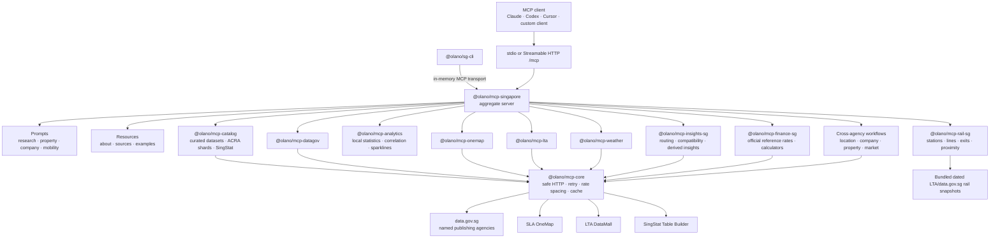

# Architecture

## Design goals

Singapore MCP is a TypeScript monorepo with three deliberately separate layers:

1. provider packages keep upstream APIs, credentials, and rate limits isolated;
2. analysis packages add deterministic calculations without hiding periods, units, or sources; and
3. the aggregate server composes tools, prompts, resources, and cross-agency workflows behind one
   MCP endpoint.

Focused packages remain independently useful, while shared runtime behavior and naming stay
consistent across the suite.

## Package responsibilities

| Layer      | Packages                                                                          | Responsibility                                                                                                            |
| ---------- | --------------------------------------------------------------------------------- | ------------------------------------------------------------------------------------------------------------------------- |
| Runtime    | `@olano/mcp-core`                                                                 | Transport flags, JSON results, environment handling, safe HTTP requests, retry, rate spacing, response bounds, and caches |
| Provider   | `@olano/mcp-datagov`, `@olano/mcp-onemap`, `@olano/mcp-lta`, `@olano/mcp-weather` | Thin validated access to one upstream service                                                                             |
| Catalog    | `@olano/mcp-catalog`                                                              | Stable names for curated data.gov.sg datasets, ACRA shards, and SingStat tables                                           |
| Domain     | `@olano/mcp-rail-sg`, `@olano/mcp-finance-sg`                                     | Rail-network queries and official mortgage-rate context with domain-specific caveats                                      |
| Analysis   | `@olano/mcp-analytics`, `@olano/mcp-insights-sg`                                  | Local statistics, semantic routing, prompt discovery, compatibility records, aligned series, and derived calculations     |
| Experience | `@olano/mcp-singapore`, `@olano/sg-cli`, `skills/*`, `plugins/*`                  | Aggregate MCP surface, workflows, prompts, resources, CLI, Agent Skills, and Claude/Codex plugins                         |

The catalog, finance, analytics, and insights packages are registration libraries. Focused executable
servers are provided where a standalone provider or domain endpoint is useful. The aggregate server
registers every layer and is the recommended default.

## MCP surface

### Tools

Tool names are stable, explicit, and namespaced by provider or domain. Low-level tools retrieve
bounded official rows. Higher-level tools calculate statistics or combine sources while returning
their assumptions. Derived results never replace the source observations.

### Prompts

The aggregate registers prompt templates for general Singapore research, neighbourhoods, companies,
property evidence, and mobility. A prompt produces instructions for the connected model; it is not a
hidden network request or an autonomous workflow.

### Resources

Read-only MCP resources expose version/affiliation information, official source references, and
example questions:

- `singapore://about`
- `singapore://sources`
- `singapore://examples`

### CLI

`@olano/sg-cli` creates the aggregate server and a client connected through MCP's in-memory
transport. This keeps `list`, `prompts`, and explicit `tool` invocation behavior aligned with a real
MCP client. `ask` is a deterministic router: it returns a recommendation and does not invoke an
external model or automatically run the recommended tool.

### Agent Skills and Claude/Codex plugins

Canonical Agent Skills live under `skills/*`. The `plugins/*` directories package byte-identical
copies beside one fixed aggregate tool profile because clients cache each installed plugin as a
self-contained directory. Each directory contains provider-specific manifests and MCP configuration
for Claude Code and Codex without duplicating the canonical skill source.
`scripts/check-claude-plugins.mjs` and `scripts/check-openai-plugins.mjs` prevent copied skills,
profile arguments, policy URLs, assets, and explicit plugin versions from drifting.

## Compatibility registry

`@olano/mcp-insights-sg` contains a machine-readable registry for 87 stable `sg_*` compatibility
capabilities. Every record includes:

- the compatibility capability name;
- the Olano tool that covers it;
- `native`, `delegated`, or `constrained` mode;
- source and freshness expectations;
- retrieval mode; and
- a limitation or calculation note.

The registry validator requires exactly 87 unique records, and repository checks verify that each
mapped Olano tool exists. A constrained record is intentional: when an upstream dataset cannot
support a claim safely, the registry points to explicit retrieval/analysis steps instead of
manufacturing unsupported results. This is a capability-coverage contract, not code or output equivalence.

## Retrieval and provenance

Provider calls use fixed base URLs and API paths. Callers can choose validated identifiers,
coordinates, filters, and bounded pagination but cannot redirect a tool to an arbitrary origin.

Public-data responses aim to preserve:

- publisher or source agency;
- dataset or table identifier;
- official source URL;
- retrieval timestamp;
- observation period and unit;
- freshness or known frozen-coverage caveat;
- cache status where available; and
- truncation or pagination information.

Cross-series tools normalise explicit monthly, quarterly, or annual periods, disclose aggregation,
match periods before comparison, and calculate correlation only on the resulting numeric pairs.
Area, company, crime, property, and finance data is not converted into unsupported personal risk,
trust, valuation, eligibility, or recommendation claims.

## Rail data model

The rail package is offline-first. It bundles normalized, dated official LTA/data.gov.sg snapshots
for station names, Chinese names, codes, lines, and exits. Station coordinates are the mean of
official exit points; nearest tools use haversine straight-line distance. They do not claim walking
distance, platform-centroid accuracy, live service status, or a current journey plan.

`rail_nearest_stations_to_address` is the exception: it first resolves the address through live
OneMap, requiring `ONEMAP_TOKEN`, and then applies the same straight-line calculation to the bundled
rail snapshot. `rail_source_metadata` exposes snapshot dates, URLs, and limitations.

## Finance boundary

The finance package calls a free official data.gov.sg dataset for SORA and published bank
interest-rate statistics. These observations are reference-rate context, not current lender product
offers. Local calculators use user-supplied rates and return formula assumptions.

No live SGX quote or insurance-premium feed is integrated because no stable free official API with
suitable production and redistribution terms has been verified. The package does not scrape product
comparison sites or silently substitute an unrelated third-party quote provider.

## Cache model

Each `JsonHttpClient` has an in-memory TTL cache. `OLANO_SG_CACHE_DIR` enables an additional optional
disk cache for eligible public responses:

1. a provider namespace isolates cache entries;
2. the request key and request-header identity are hashed for the file name;
3. the entire query string is omitted from stored source metadata;
4. provider-specific TTLs determine whether an entry may be reused; and
5. cache failures do not turn a valid upstream request into a tool failure.

The cache is an efficiency layer, not an authoritative datastore. Deployers remain responsible for
directory permissions, tenant isolation, retention, backups, and deletion requirements. Cached
response payloads may contain addresses, company searches, or other request results, so a cache
directory must not be shared across untrusted tenants.

## Transport and deployment

Stdio is the default for local desktop and coding clients. `--transport http` creates a Streamable
HTTP endpoint at `/mcp`; server factories produce fresh MCP server instances as required by the SDK
transport model.

The built-in HTTP listener is suitable for local or trusted-network use. An internet-facing
deployment must add TLS, authentication, tenant isolation where relevant, request limits, logging,
and monitoring at the gateway or application boundary.

## Upstream safety

- Zod schemas constrain identifiers, enums, coordinates, filters, and pagination.
- Requests have timeouts, response-size limits, rate spacing, and bounded retries.
- Secrets come from environment variables and enter only provider-specific headers.
- Tool implementations are read-only.
- Missing credentials produce explicit errors rather than partially fabricated responses.
- Live, snapshot, historical, and frozen data are labelled differently.

## Adding a provider or domain package

New packages should follow the existing registration contract:

- export `register...Tools(server)` for aggregate composition;
- export `create...Server()` when the package is independently runnable;
- use `@olano/mcp-core` for HTTP and result handling;
- choose stable, namespaced tool names and bounded schemas;
- include source, freshness, unit, and limitation metadata;
- add success, invalid-input, no-match, pagination, and upstream-failure tests as applicable; and
- update prompt discovery and compatibility mapping only when the new tool genuinely supports the
  stated capability.
